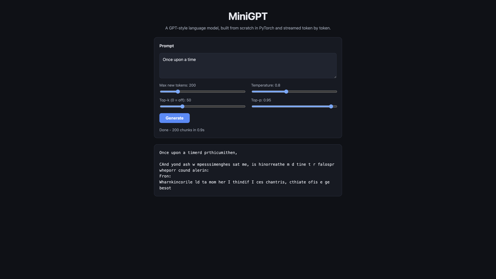

# MiniGPT

[](https://github.com/Ilyes-Jamoussi/minigpt-llm/actions/workflows/ci.yml)
[](LICENSE)

A GPT-style decoder-only language model **built from scratch in PyTorch** — causal multi-head
attention, learned positional embeddings, weight tying, and autoregressive sampling — served
through a **typed, tested FastAPI service** that **streams tokens live** to a web demo.

No `nn.Transformer`, no HuggingFace `transformers` for the model. The attention, causal
masking, byte-level BPE tokenizer, and sampling are all implemented here.

> **Live demo:** deploy on [Streamlit Community Cloud](https://share.streamlit.io/) (see
> [Deployment](#deployment)) — repo `Ilyes-Jamoussi/minigpt-llm`, entrypoint `app.py`.
> Same setup as [MailGuard AI](https://mailguard-ai.streamlit.app).



## How It Works

Text goes through the following pipeline:

1. **Tokenization** — a from-scratch character-level or byte-level BPE tokenizer maps text to
   integer ids. The BPE tokenizer is trained on the train split only.
2. **GPT forward pass** — token + positional embeddings pass through pre-LN transformer blocks
   with causal multi-head self-attention (position `t` attends only to `≤ t`), then a tied LM
   head outputs next-token logits.
3. **Training** — next-token cross-entropy with AdamW, cosine LR schedule with linear warmup,
   gradient clipping, and mixed precision on CUDA.
4. **Generation** — autoregressive sampling with temperature, top-k, and top-p (nucleus);
   greedy when `temperature → 0`.
5. **Serving** — FastAPI loads the model once at startup and exposes full and streaming
   (`Server-Sent Events`) generation endpoints plus a minimal web demo.

## Model Architecture

```
Prompt text
  → Tokenization (char or byte-level BPE)
  → Token Embedding (d=256) + Positional Embedding
  → Transformer Block × 4
      ├── Causal Multi-Head Self-Attention (4 heads, lower-triangular mask)
      ├── Residual + Layer Norm (pre-LN)
      ├── MLP (256 → 1024 → 256, GELU)
      └── Residual + Layer Norm (pre-LN)
  → Final LayerNorm
  → Linear LM head (weights tied to token embedding)
  → Autoregressive sampling → generated text
```

Committed model (TinyShakespeare, char-level): **3,208,960 parameters**, `block_size=128`.

## Dataset

The committed model is trained on [TinyShakespeare](https://github.com/karpathy/char-rnn)
(~1.1 MB of Shakespeare text). The train/val split is deterministic and contiguous (90/10);
the tokenizer vocabulary is built on the train split only.

For coherent English generation, train the byte-level BPE + [TinyStories](https://huggingface.co/datasets/roneneldan/TinyStories)
configuration via the Colab notebook (~10M parameters, vocab 8192).

## Training

Run on a GPU via the Colab notebook, or locally on CPU (~4 minutes for the committed char model).

- Optimizer: AdamW (lr=3e-4 → 3e-5 cosine, warmup 100 steps)
- Weight decay: 0.1 (matrices only), gradient clip: 1.0
- Mixed precision (AMP) when CUDA is available
- Best checkpoint selected by validation loss
- Seeded (`random` / `numpy` / `torch`) for reproducible runs
- Artifacts saved as `safetensors` + JSON (no pickle)

## Results

Committed char-level model (TinyShakespeare, 1,000 training steps, CPU):

| Metric | Value |
| --- | --- |
| Parameters | 3,208,960 |
| Tokenizer | character-level, vocab 65 |
| Validation perplexity | **7.62** |
| Tokens seen | **4,091,904** |

Sample generation (`temperature=0.8, top_k=50, top_p=0.95`, prompt `ROMEO:`):

```
ROMEO:
Th bearers, avestowe nir, t I tey s adonour th mprthilin t h her the p adote that thinthen fumsthen s,
Andithet me me blood the thar onganghecerd,
Thenghished mat t arere ar t tavee be ge fon wasther
```

The output captures Shakespeare-like structure (line breaks, character names) after only
1,000 steps. For fluent English, train the BPE + TinyStories model via the notebook.

## Limitations

The committed model is a small character-level LM trained briefly on Shakespeare — useful to
demonstrate the full pipeline (train → serve → stream), not state-of-the-art text quality.
The natural next step is the TinyStories BPE run in the Colab notebook.

## Project Structure

```
├── app.py                     # Streamlit UI (rendering only)
├── assets/
│   └── styles.css             # UI styling (kept out of logic)
├── api/
│   └── main.py                # FastAPI service (SSE streaming)
├── demo/
│   ├── index.html             # Streaming web UI
│   ├── app.js                 # fetch + SSE client
│   └── styles.css             # UI styling (kept out of logic)
├── src/
│   ├── config.py              # Single source of truth: hyperparameters, paths, seed
│   ├── tokenizer.py           # Char + byte-level BPE tokenizers (from scratch)
│   ├── model.py               # GPT decoder-only model (from scratch)
│   ├── data.py                # Dataset download, split, batching
│   ├── train.py               # Training loop, checkpointing, evaluation
│   ├── generate.py            # Sampling utils + CLI
│   └── inference.py           # Model loading + streaming (used by Streamlit)
├── models/
│   ├── model.safetensors      # Trained weights (Git LFS)
│   ├── config.json            # Model hyperparameters
│   ├── tokenizer.json         # Fitted tokenizer
│   └── metrics.json           # Training metrics
├── tests/                     # Tokenizer, causal mask, model, train, API
├── notebooks/
│   └── train_minigpt.ipynb    # Colab notebook for BPE + TinyStories
├── Dockerfile                 # Minimal CPU container for API + demo
├── pyproject.toml             # ruff / mypy / pytest config
├── requirements.txt           # Runtime dependencies (pinned)
└── requirements-dev.txt       # Dev/tooling dependencies (pinned)
```

## Deployment

Deploy on **[Streamlit Community Cloud](https://share.streamlit.io/)** (same as MailGuard AI):

1. Sign in with GitHub at [share.streamlit.io](https://share.streamlit.io/).
2. Click **Create app** → pick repository **`Ilyes-Jamoussi/minigpt-llm`**, branch **`main`**, main file **`app.py`**.
3. Click **Deploy** (first build takes a few minutes — PyTorch + Git LFS weights).
4. Copy your app URL (often `https://minigpt-llm.streamlit.app`) and add it at the top of this README.

The app is **public by default** once deployed. Any push to `main` triggers an automatic redeployment.

The repo also ships a minimal CPU `Dockerfile` for self-hosting the FastAPI service + demo:

```bash
docker build -t minigpt .
docker run -p 8000:8000 minigpt
```

### Run locally

```bash
pip install -r requirements.txt
streamlit run app.py          # live streaming demo (same as deployed app)
uvicorn api.main:app          # FastAPI + browser demo at http://localhost:8000/
```

### Train the BPE model (recommended)

On Google Colab (GPU):

1. Open `notebooks/train_minigpt.ipynb` in [Google Colab](https://colab.research.google.com).
2. Set the runtime to GPU (Runtime → Change runtime type → GPU).
3. Run all cells — the notebook downloads TinyStories, trains the BPE tokenizer and model,
   and writes artifacts to `models/`.
4. Download the four files from `models/` and replace the committed artifacts.

Or locally, from the repository root:

```bash
python -m src.train --dataset tinyshakespeare --tokenizer-type char --max-steps 1000
python -m src.generate --prompt "ROMEO:" --max-new-tokens 200
```

## Development

```bash
pip install -r requirements-dev.txt
ruff format . && ruff check . && mypy src api && pytest
```

## Tech Stack

- **PyTorch** — tensors, autograd, model building
- **safetensors** — safe model-weight serialization
- **FastAPI + uvicorn** — typed streaming inference API
- **datasets** — TinyStories loader (training only)
- **ruff / mypy / pytest** — linting, type checking, tests
